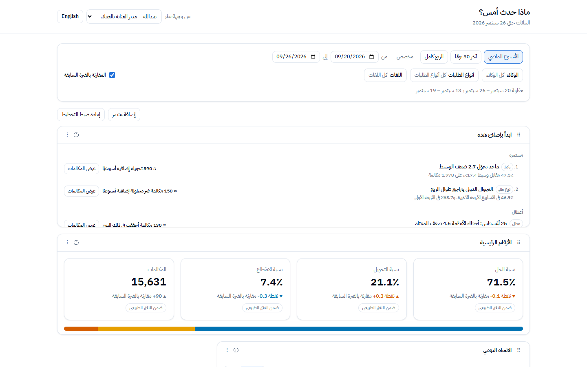
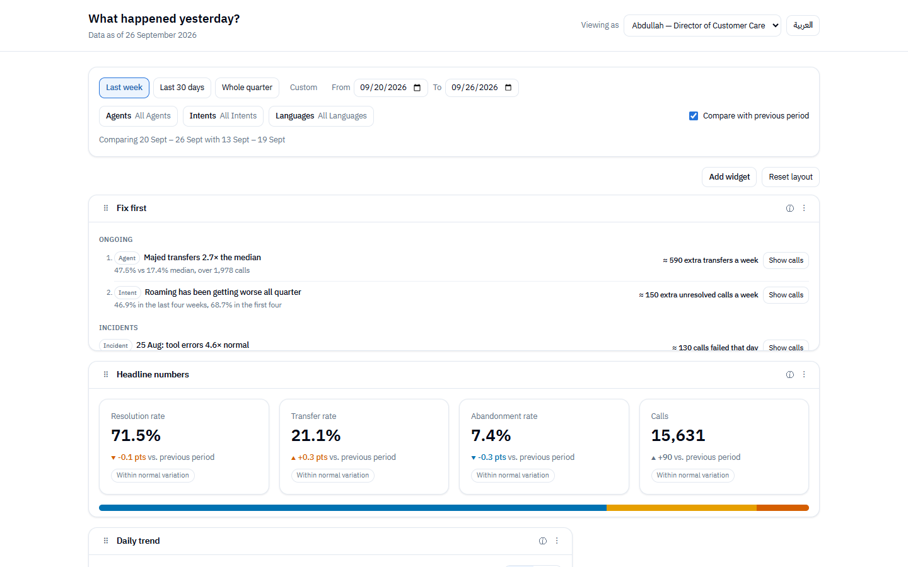

# What Happened Yesterday?

An analytics canvas for a contact-center director who has ten minutes before the Sunday ops meeting. It answers three questions: are the AI agents resolving more calls than last week, where are they failing, and what should the team fix first. Arabic first, right to left.




More detail: [ARCHITECTURE.md](ARCHITECTURE.md) (how it's built and why), [AI_NOTES.md](AI_NOTES.md) (how I used AI), [ANSWERS.md](ANSWERS.md) (Parts 2 and 3).

## Run it

Requires Node 20.19+ or 22.12+ (developed on Node 25) and, for the end-to-end tests, Google Chrome.

```
npm install
npm run dev              # http://localhost:5173
```

| Command | What it does |
|---|---|
| `npm test` | Unit, differential, multi-seed and render tests |
| `npm run test:tz` | The unit suite under UTC, Los Angeles and Kiritimati |
| `npm run test:detectors` | False-alarm sweep over 50 anomaly-free quarters |
| `npm run test:e2e` | Playwright: seed and history, three browser time zones, drill-down and Back, overflow in EN/AR (serial, about a minute) |
| `npm run test:e2e:shots` | Regenerates the README screenshots |
| `npm run bench` | Aggregation, drill-down and sort timings on 200,000 rows |
| `npm run lint` | ESLint plus the logical-CSS check |
| `npm run build` | Production build |

## Finding the three stories

Open the app with no parameters. The default view is last week (20–26 September) and the **Fix first** panel at the top lists:
1. **Agents names are Personas for the AI Agents**
2. **Majed** transfers 2.7× the median of the AI agents, about 594 extra transfers a week.
3. **Roaming** resolution fell from about 69% to 47% across the quarter, about 147 extra unresolved calls a week.
4. **25 August**, an incident day: tool errors 4.6× a normal Tuesday.

Each has **Show calls**, which opens the calls behind it. The Daily trend marks 25 August on the chart; the Intents table badges roaming as declining; the AI agents widget flags Majed against the median.

To check it isn't hard-coded, click **Shuffle** in the footer. A new seed generates a new quarter and hides the three problems on a different agent, intent and day. The seed is in the URL, so a shuffled view can be shared. **Reset** returns to the default.

## Why these widgets

| Widget | Question |
|---|---|
| Fix first | What should the team fix first? |
| Headline numbers | Are the AI agents resolving more than last week? (with a plain-language answer line) |
| Daily trend | When did things go wrong? |
| Intents | Where is the biggest pain? Ranked by unresolved calls |
| AI agents | Which agent is failing? Transfer rate against the median |
| Failure reasons | Why are calls handed to a human? Per 100 calls |

Left out on purpose: an average-sentiment gauge (an average hides the calls that turn bad), average handle time (a shorter AI call is not better if it gave up), pie charts (hard to compare), and a language widget (language is a filter). The peak-hours heatmap was built into the engine but cut as a widget for time; it answered none of the three questions.

## Key decisions and trade-offs

- **All heavy work in a Web Worker, on typed-array columns.** One pass per query, counts only. The main thread renders, computes rates and runs the detectors on the small aggregates.
- **Asia/Riyadh as integer day arithmetic.** No browser-local `Date` getters anywhere, enforced by lint. Proven by tests in three process time zones and three browser time zones.
- **Weekday-aligned comparisons.** The comparison period shifts back by whole weeks so both periods contain the same weekdays.
- **Two tests before anything is flagged.** A z-test ("is it real?") and a materiality threshold ("is it worth acting on?"). Without the second, 13 intents carried a badge; with it, one does.
- **Context over the selected range.** The Daily trend and sparklines always show the whole quarter with the selection highlighted, so a slow decline and a past incident stay visible in a one-week view.
- **Honest charts.** Value axes start at zero, no dual axes, shared sparkline scale, rates per 100 calls.
- **URL as the view state.** Filters, drill-down and seed are shareable; UI language stays a per-user preference.
- **Arabic numerals decision.** Western digits (`ar-SA-u-nu-latn`): common in Saudi business dashboards and easier to scan in dense charts. One setting in `format.ts` switches to Arabic-Indic digits.
- **Trade-off accepted:** resizing is a size menu (4/6/8/12 columns, S/M/L), not free pixel resizing. That's what made RTL and keyboard support straightforward.

## Performance

200,000 rows, Node, median / p95:

| Operation | Time |
|---|---|
| Aggregate (every widget's data, one pass) | 0.7–4.4 ms / under 8 ms |
| Naive baseline (objects + `new Date`, KPIs only) | 7–48 ms / up to 60 ms, 7–15× slower |
| Drill-down | 0.2–0.9 ms / under 1.6 ms |
| Sort 200,000 rows (in the worker) | 34–52 ms / under 58 ms |
| Browser, last week (warm) | about 6 ms in the worker, 8–15 ms round trip |

## Assumptions

- "Today" is fixed at Sunday 2026-09-27; the data covers the 90 days before it. This keeps numbers and screenshots reproducible.
- The Ramadan-style month (24 July to 22 August 2026) is simulated, as the brief asks. It is not the real Ramadan 1447.
- "Resolved" means the AI agent resolved the call without a human (containment). "Transferred" means handed to a human.
- The agents are AI personas with human-sounding names.
- "Remember the layout per user" with no auth: a profile switcher (Abdullah, and Layla as the VP). Each profile keeps its own layout and language.
- Gregorian calendar only.

## What I cut

- The peak-hours heatmap widget (time).
- Export as PNG/CSV: the brief allows one stretch goal; I chose automatic callouts because they find the three stories.
- Hijri dates, dark mode.
- An ARIA grid pattern for the intents table (keyboard moves row by row instead).
- The "Last 7 days" preset: identical to "Last week" whenever today is a Sunday.

## With another week

- Detect step changes, not just linear trends, and measure the lowest intent volume the decline detector can handle.
- A screen-reader pass with NVDA and VoiceOver, and a keyboard-only pass at phone width.
- CI with a pinned Chromium, and a check that keeps the README screenshots current.
- Export with the filters and date range baked in.
- Instrument which widgets Abdullah actually uses before adding more.
- A backend contract that sends columnar or pre-aggregated data, so only the worker's `init()` changes.

## Decision log

| Decision | Changed my mind? | Commit |
|---|---|---|
| Replace the planned `react-grid-layout` with `dnd-kit` + CSS grid (no RTL, no keyboard support) | Yes | `76290dc` |
| Compare with the same weekdays, shifted by whole weeks, instead of the immediately preceding days (a false volume drop, two Fridays vs one) | Yes | `ad681f3` |
| Flag changes only when significant AND material (13 badges → 1) | Yes | `66b157b` |
| Incident baseline: from a symmetric window to Theil–Sen detrending, so yesterday can be judged | Yes | `997a9d3` |
| Cut the peak-hours heatmap widget | Yes | `35cf83e` |
| Tooltips on hover with hidden text, instead of 50 extra Tab stops | Yes | `3bb6599` |
| Daily trend and sparklines show the whole quarter, not the selected range | No, decided before building | `37dc81f` |

## Time

About 6 and a half hours in total, including reviewing and testing AI output. See AI_NOTES.md for how the work was split.
